# Autour des Fractales

## Diagramme UML

```plantuml
@startuml
interface IComplex {
+{abstract}getRealPart()
+{abstract}getImaginaryPart()
+{abstract}abs()
+{abstract}negate()
+{abstract}conjugate()
+{abstract}add(IComplex other)
+{abstract}substract(IComplex other)
+{abstract}multiply(Icomplex other)
+{abstract}multiply(double value)
+{abstract}divide(Icomplex other)
}

class PlanComplexTranslationDecorator {
 + asComplex(row, column)
 + PlanComplexTranslationDecorator(constante, plan, width, height)
}

class PlanComplexZoomDecorator {
 + asComplex(row, column)
 + PlanComplexZoomDecorator(constante, plan, width, height)
}

class PlanComplex {
 - width
 - height
 + PlanComplex(width, height)
 + asComplex(row, column)
 + getWidth()
 + getHeight()
}

interface IPlanComplex {
 + {abstract}asComplex(row, column)
 + {abstract}getWidth()
 + {abstract}getHeight()
}

abstract class PlanComplexDecorator {
 + asComplex(row, column)
 + getWidth()
 + getHeight()
}

class Complex {

-real
-imaginary

+Complex(int real, int imaginary)
+Complex()
+getRealPart()
+getImaginaryPart()
+abs()
+negate()
+conjugate()
+add(IComplex other)
+substract(IComplex other)
+multiply(Icomplex other)
+multiply(double value)
+divide(Icomplex other)
+toString()
+hashCode()
+equals(Object other)

}


interface IStrategieSuite {
 + determinerTermeSuivant(IComplex termeAnterieur) : IComplex
}

interface Iterator<E> {
 + {abstract} next() : E
 + {abstract} hasNext() : boolean
}

class SuiteIterator {
 - iterationMax : int
 + SuiteIterator(IStrategie suite, IComplex terme, int iterationMax)
 + hasNext() : boolean
 + next() : IComplex
}

class SuiteMandelbrot {
 - maxIteration : int
 + SuiteMandelbrot(maxIteration, c, z)
 + determinerTermeSuivant(IComplex termeAnterieur) : IComplex
 + iterator() : Iterator<IComplex>
}

class SuiteJulia {
 - maxIteration : int
 + SuiteJulia(maxIteration, c, z)
 + determinerTermeSuivant(IComplex terme)
 + iterator() : Iterator<IComplex>
}


interface Iterable<E> {
 + {abstract} iterator() : Iterator<E>
}

class BufferedImage {

}

interface IFractalImage {
 + {abstract} getHeight()
 +{abstract} getWidth()
 + {abstract} getPixel(row, column)
 + {abstract} setColor(row, column, color)
 + {abstract} saveAs(path)
}

class AdaptateurImage {
  +  getHeight()
 + getWidth()
 +  getPixel(row, column)
 +  setColor(row, column, color)
 +  saveAs(path)
}

class Pixel {
 - row
 - column
 + Pixel(image, row, column)
 + getRow()
 + getColumn()
 + getImage()
 + setColor(color)
}

interface IPoint {
 + getX()
 + getY()
 + distance(other: IPoint)
}

class Point {
 - x
 - y
 + Point(x,y)
 + getX()
 + getY()
 + distance(other : IPoint)
}

class ComplexAdaptateur {
 + ComplexAdaptateur(complex)
 + getX()
 + getY()
 + distance(other : IPoint)
}

interface IFigure {
 + {abstract} getSVG()
}

abstract class AbstractFigure {
 - x
 - y
 - Color
 + AbstractFigure(x, y, color)
}

class FigureRectangle {
 - width
 - height
 + getSVG()
 + FigureRectangle(x, y, color, width, height)
}

class FigureCarre {
 - cote
 + FigureCote(x, y, color, cote)
}

class FigureCercle {
 - rayon
 + FigureCercle(x, y, color, rayon)
 + getSVG()
}

abstract class FigureDecorator {
 - figure : IFigure
 + FigureDecorator(figure)
 + getFigure()
}

class FigureTransformScaleDecorator {
 - scale
 + FigureTransformScaleDecorator(figure, scale=1)
 + getSVG()
}

class FigureTransformRotateDecorator {
 - rotate
 + FigureTransformScaleDecorator(figure, rotate=0)
 + getSVG()
}

class FigureTransformTranslationDecorator {
 - translateX
 - translateY
 + FigureTransformScaleDecorator(figure, translateX, translateY)
 + getSVG()
}

class FigureComposite {
 + getSVG()
 + add()
 + remove()
}

interface IStrategieCouleurs {
 + {abstract} palette(nbItMax, nbIteration) : Color
}

class PaletteJaune {
 + palette(nbItMax, nbIteration) : Color
}

class PaletteRouge {
 + palette(nbItMax, nbIteration) : Color
}

abstract class CouleurDecorateur {
 + CouleurDecorateur(IStrategieCouleurs palette)
}

class CouleurDecorateurR {
 + CouleurDecorateurR(IStrategieCouleurs palette)
 + palette(int nbItMax, int nbIterations)
}

class CouleurDecorateurV {
 + CouleurDecorateurV(IStrategieCouleurs palette)
 + palette(int nbItMax, int nbIterations)
}

class CouleurDecorateurB {
 + CouleurDecorateurB(IStrategieCouleurs palette)
 + palette(int nbItMax, int nbIterations)
}

interface IStrategieSuiteChaotique {
 + determinerTermeSuivant(pointAnterieur)
}

class SuiteChaotiqueCirculaire {
 - premierPoint
 - iterationMax
 + SuiteChaotiqueCirculaire(IPoint premierPoint, int interationMax)
 + derterminerTermeSuivant(IPoint pointAnterieur)
 + iterator()
}

class SuiteChaotiqueFeigenbaum {
 - premierPoint
 - iterationMax
 + SuiteChaotiqueFeigenbaum(IPoint premierPoint, int interationMax)
 + derterminerTermeSuivant(IPoint pointAnterieur)
 + iterator()
}

class SuiteChaotiqueIterator {
 + SuiteChaotiqueIterator(IStrategieSuiteChaotique suite, int interationMax, IPoint point)
 + hasNext()
 + next()
}

SuiteChaotiqueIterator *-- IStrategieSuiteChaotique : - suite
SuiteChaotiqueIterator *-- IPoint : - point
Iterator <|--[dashed] IStrategieSuiteChaotique
Iterable <|--[dashed] SuiteChaotiqueCirculaire
IStrategieSuiteChaotique <|--[dashed] SuiteChaotiqueCirculaire
Iterable <|--[dashed] SuiteChaotiqueFeigenbaum
IStrategieSuiteChaotique <|--[dashed] SuiteChaotiqueFeigenbaum
IStrategieCouleurs <|--[dashed] PaletteRouge
IStrategieCouleurs <|--[dashed] PaletteJaune
IStrategieCouleurs <|--[dashed] CouleurDecorateur
IStrategieCouleurs *-- CouleurDecorateur : - palette

CouleurDecorateur <|--- CouleurDecorateurR
CouleurDecorateur <|--- CouleurDecorateurV
CouleurDecorateur <|--- CouleurDecorateurB

IFigure <|--[dashed] FigureDecorator
IFigure <|--[dashed] FigureComposite
FigureComposite *-- AbstractFigure : - figures
FigureDecorator <|--FigureTransformScaleDecorator
FigureDecorator <|--FigureTransformRotateDecorator
FigureDecorator <|--FigureTransformTranslationDecorator
IFigure <|--[dashed] AbstractFigure
AbstractFigure <|-- FigureRectangle
IPoint <|---[dashed] ComplexAdaptateur
AbstractFigure <|-- FigureCercle
IComplex *--- ComplexAdaptateur : - complex
IPoint <|---[dashed] Point
IFractalImage *-- Pixel : - image
SuiteIterator *-- IStrategieSuite : suite
Iterator <--[dashed] SuiteIterator
FigureRectangle <|-- FigureCarre
IFractalImage <--[dashed] AdaptateurImage
AdaptateurImage *-- BufferedImage : - image

SuiteIterator <--[dashed] SuiteMandelbrot
Iterable <--[dashed] SuiteMandelbrot

SuiteIterator <--[dashed] SuiteJulia
Iterable <--[dashed] SuiteJulia

SuiteIterator *-- SuiteJulia : iterator
SuiteIterator *-- SuiteMandelbrot : iterator
IComplex *-- SuiteIterator: - terme
IComplex *-- SuiteJulia : - c
IComplex *-- SuiteJulia : - z
IComplex *-- SuiteMandelbrot : - z

IComplex <|---[dashed]Complex
IPlanComplex<|---[dashed]PlanComplexDecorator
PlanComplexDecorator<|---PlanComplexTranslationDecorator
PlanComplexDecorator<|---PlanComplexZoomDecorator
IPlanComplex<|----[dashed]PlanComplex
PlanComplexDecorator *-- PlanComplex : use
PlanComplexZoomDecorator *-- IComplex : - constante
PlanComplexTranslationDecorator *-- IComplex : - constante
@enduml
```




## Description

Ce projet fournit une implantation de base pour votre projet de SAÉ S3.A.01.
Pour pouvoir développer votre propre implantation de ce projet, vous devez
en créer une **divergence** en cliquant sur le bouton `Fork` en haut à droite
de cette page.

Lorsque ce sera fait, vous pourrez inviter les membres de votre groupe en tant
que *Developer* pour vous permettre de travailler ensemble sur ce projet.

## Exécution

Pour exécuter l'application, vous pouvez exécuter la tâche `run` de *Gradle*.
Afin de vous permettre de facilement contrôler la création des fractales depuis
la ligne de commande, la classe `fr.univartois.butinfo.fractals.Fractals` (qui
définit la méthode `main`) gère déjà pour vous les arguments de cette ligne
de commande (les options données sont stockées dans les attributs de cette
classe).
Vous pouvez en particulier l'exécuter à l'aide des options suivantes :

```
-f,--fractal-name  <name>      Spécifie le nom de la fractale à générer.
-h,--height        <pixels>    Spécifie la hauteur de l'image à générer.
-n,--nb-iterations <integer>   Spécifie le nombre d'itérations à appliquer pour générer la fractale.
-o,--output        <file>      Spécifie le nom du fichier dans lequel la fractale doit être sauvegardée.
-p,--palette-name  <name>      Spécifie le nom de la palette de couleurs à appliquer lors de la génération.
-s,--scale         <ratio>     Spécifie l'échelle à appliquer sur l'image.
-w,--width         <pixels>    Spécifie la largeur de l'image à générer.
-x,--focus-x       <real>      Spécifie le point central de l'image sur l'axe des abscisses.
-y,--focus-y       <real>      Spécifie le point central de l'image sur l'axe des ordonnées.
```

Évidemment, vous devrez compléter la classe `Fractals` pour qu'il se passe
quelque chose lors de l'exécution !

## JAR exécutable

Vous avez également la possibilité de générer un JAR à l'aide de *Gradle*, en
exécutant la tâche `jar`.
Ce JAR constitue un exécutable que vous pouvez facilement distribuer, et que
vous pouvez exécuter de la manière suivante :

```bash
java -jar build/libs/sae-2022-2023.jar --help
```

Les options acceptées par ce JAR sont les mêmes que celles décrites dans la
section précédente.
